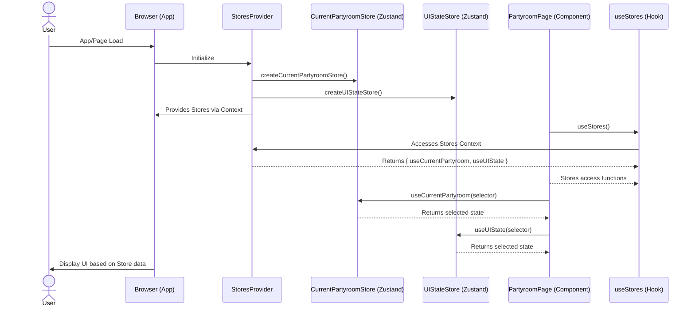
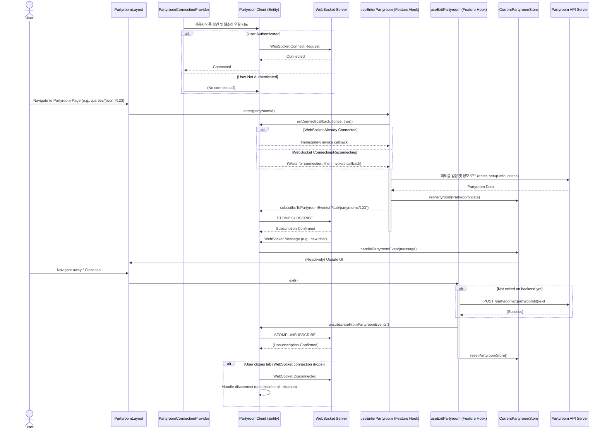
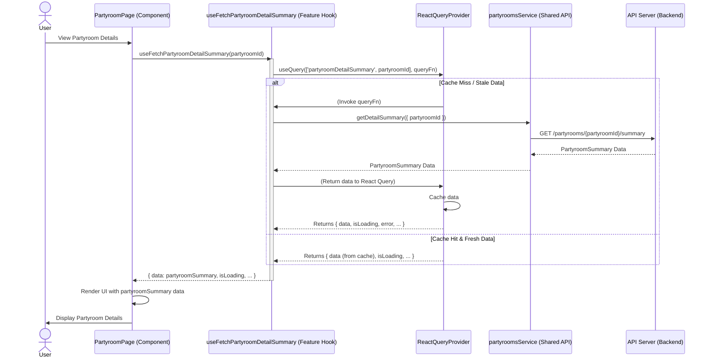

# 프로젝트 주요 데이터 흐름 (Mermaid Sequence Diagrams)

## 다이어그램 1: `StoresProvider`를 사용한 의존성 역전 및 스토어 접근 흐름

**설명:**

1.  사용자가 앱/페이지를 로드합니다.
2.  `StoresProvider`가 초기화되면서 `CurrentPartyroomStore`와 `UIStateStore`의 Zustand 스토어 인스턴스를 생성합니다.
3.  `StoresProvider`는 이 스토어 접근 함수들을 React Context를 통해 하위 컴포넌트에 제공합니다.
4.  `PartyroomPage` (또는 다른 컴포넌트)에서 `useStores` 훅을 호출합니다.
5.  `useStores` 훅은 Context로부터 스토어 접근 함수들을 가져와 반환합니다.
6.  페이지는 반환된 함수(예: `useCurrentPartyroom`)와 셀렉터를 사용하여 스토어의 특정 상태를 구독하고 값을 가져옵니다.
7.  가져온 스토어 데이터를 기반으로 UI가 사용자에게 표시됩니다.
    - 이는 FSD에서 `shared` 레이어(`StoresProvider`, `useStores`)를 통해 `entities` 레이어(`CurrentPartyroomStore`, `UIStateStore`)의 상태를 `pages` 또는 `widgets` 레이어에서 사용하는 의존성 역전의 예시입니다.

## 다이어그램 2: `Partyroom` 연결/구독 및 해제/구독 해제 흐름

**설명:**

1.  **초기 연결:**
    - `PartyroomConnectionProvider` (PCP)가 사용자 인증 상태를 확인하고, 인증된 경우 `PartyroomClient`를 통해 웹소켓 연결을 시도합니다.
2.  **파티룸 입장:**
    - 사용자가 파티룸 페이지로 이동하면 `PartyroomLayout`이 `useEnterPartyroom` 훅의 `enter` 함수를 호출합니다.
    - `enter` 함수는 웹소켓 연결을 확인 후, API 서버에서 파티룸 입장 처리 및 필요한 데이터(설정 정보, 공지 등)를 가져와 `CurrentPartyroomStore`를 초기화합니다.
    - 이후 `PartyroomClient`를 통해 해당 파티룸의 실시간 이벤트 구독을 시작합니다.
    - 웹소켓 서버로부터 이벤트 메시지가 수신되면 `PartyroomClient`가 이를 처리하여 `CurrentPartyroomStore`를 업데이트하고, UI가 이에 반응하여 변경됩니다.
3.  **파티룸 퇴장:**
    - 사용자가 페이지를 벗어나면 `PartyroomLayout`이 `useExitPartyroom` 훅의 `exit` 함수를 호출합니다.
    - `exit` 함수는 필요한 경우 API 서버에 퇴장을 알리고, `PartyroomClient`를 통해 이벤트 구독을 해제하며, `CurrentPartyroomStore`를 초기 상태로 리셋합니다.
    - 브라우저 탭 종료 등으로 웹소켓 연결이 직접 끊어지는 경우, `PartyroomClient`가 이를 감지하여 모든 구독을 해제하고 정리 작업을 수행합니다.

## 다이어그램 3: 일반적인 데이터 조회 흐름 (예: 파티룸 상세 정보)

**설명:**

1.  사용자가 파티룸 상세 정보를 보려고 합니다 (페이지 로드 또는 특정 액션).
2.  `PartyroomPage` 컴포넌트는 `useFetchPartyroomDetailSummary` 훅을 호출합니다.
3.  이 훅은 내부적으로 React Query (`useQuery`)를 사용하여 데이터를 요청합니다.
4.  React Query는 캐시를 확인합니다.
    - **캐시 미스 또는 데이터가 오래된 경우:** React Query는 제공된 `queryFn` (여기서는 `partyroomsService.getDetailSummary`)을 실행하여 백엔드 API 서버로부터 데이터를 가져옵니다. 가져온 데이터는 캐시되고 훅으로 반환됩니다.
    - **캐시 히트 및 데이터가 최신인 경우:** React Query는 캐시된 데이터를 즉시 반환합니다.
5.  훅은 데이터, 로딩 상태 등을 페이지 컴포넌트에 반환합니다.
6.  페이지 컴포넌트는 이 데이터를 사용하여 UI를 렌더링하고 사용자에게 보여줍니다.
    - 이는 FSD에서 `features` 레이어의 훅이 `shared/api`를 사용하여 데이터를 가져오고, 이 데이터를 `pages` 또는 `widgets` 레이어에서 소비하는 일반적인 흐름입니다. `ReactQueryProvider`는 `app` 레이어에 위치하여 전역적으로 캐싱 및 상태 관리를 지원합니다.
